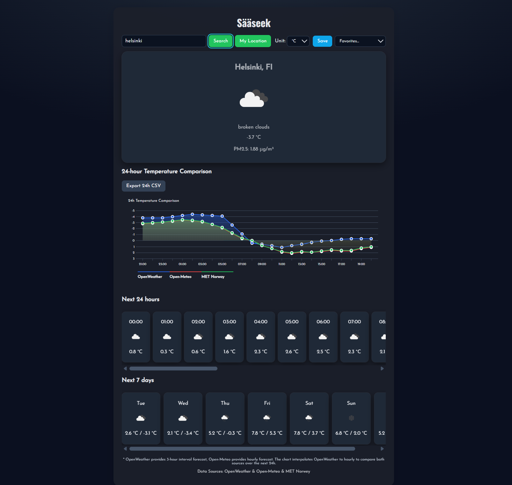
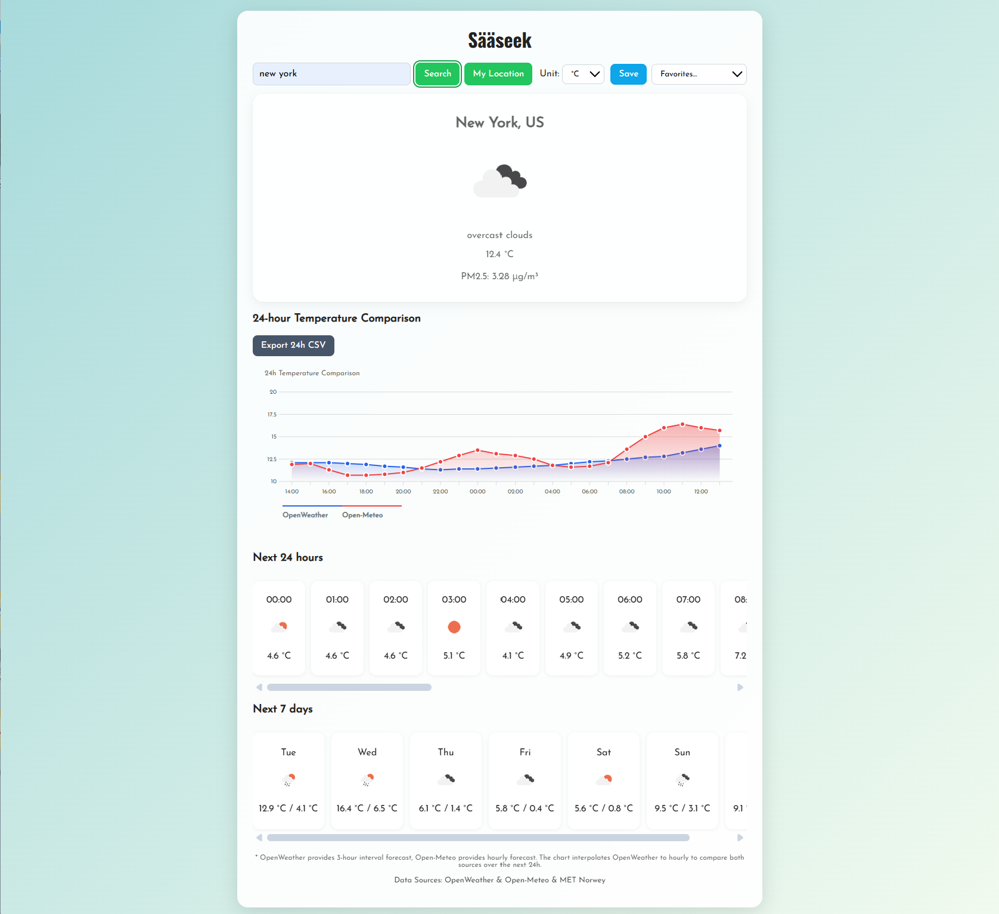
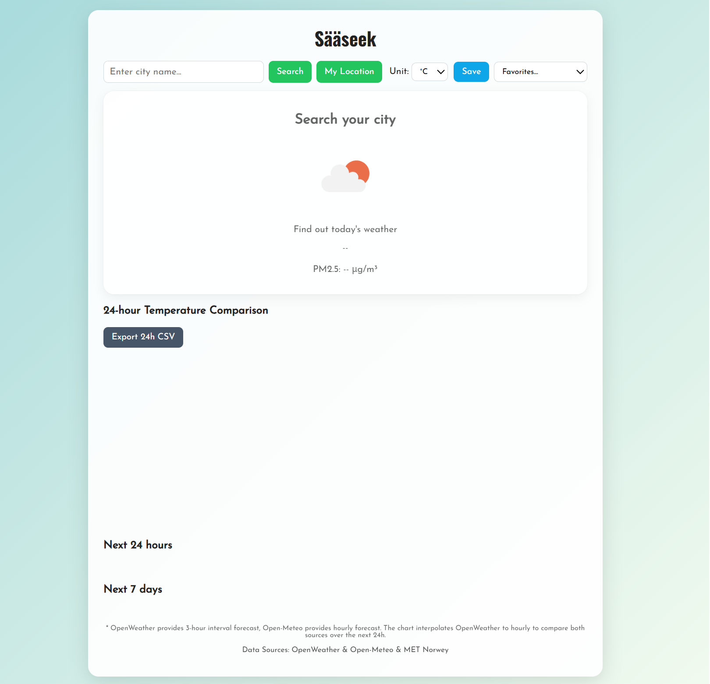

# 🌤️ Sääseek — A Clean & Simple Weather Dashboard

Sääseek is a lightweight and user-friendly weather dashboard that allows users to:
- Search for any city
- See current temperature, PM2.5, and weather conditions  
- Compare 24-hour temperatures using high-resolution data  
- Export hourly data as CSV  
- Save favorite locations  
- Automatically detect current location  
- Choose temperature units (°C / °F)

The project focuses on **clean UI**, **API integration**, and **data visualization**, using OpenWeather and Open-Meteo.

---

## 🚀 Features

### 🔍 **Search Any City**
- Intelligent search bar  
- Autocomplete-ready structure  
- Dynamic UI updates  

### 📍 **My Location**
- Fetches current coordinates  
- Auto-loads local weather  
- Handles location permission gracefully  

### ☁️ **Current Weather Info**
- Temperature  
- Weather icon  
- PM2.5 air quality (μg/m³)

### 📊 **24-Hour Temperature Comparison**
- Merges **Open-Meteo hourly forecast** with **OpenWeather 3-hour forecast**  
- Smoothed chart for easier comparison  
- One-click “Export 24h CSV”  

### ⭐ **Save Favorites**
- Save frequently viewed cities  
- Quick access dropdown  

### 🎨 **Clean UI & Responsive Layout**
- Soft gradients  
- Card-based layout  
- Mobile-friendly design  

---

## 🖼️ Screenshots

### 🔹 Main Interface

### 🔹 City Weather Overview

### 🔹 24-Hour Temperature Comparison Chart

---

## 🏗️ Tech Stack

### **Frontend**
- HTML5  
- CSS3 (custom design, gradients, layout system)  
- JavaScript (DOM, async/await, event handling)

### **APIs**
- **OpenWeather API**
- **Open-Meteo API**
- **MET Norway**

### **Data Handling**
- JSON parsing  
- Async fetch pipelines  
- CSV generation  

---

## 📦 Project Structure

